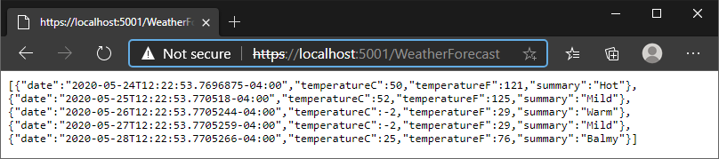

# webapi
.NET 5 web API service template for Datacrunch Platform using Docker containers.  Image for Windows and Linux can be found here: https://hub.docker.com/r/pnvnd/webapi

## Microservice
1. Download and install .NET 5 from https://dotnet.microsoft.com/download/dotnet/5.0
2. Create new folder/repository and run `dotnet new webapi` in the terminal to create the WeatherForecast template project
3. Use `dotnet build webapi .` to build the project.  Take note of the path to `webapi.dll`
4. Run the program by using `dotnet webapi.dll` (change directory or use full path)
5. Check with browser to see if it works: https://localhost:5001/WeatherForecast

## Containerize Microservice with Docker
6. If it works, add `"Urls": "http://*:5000;https://*:5001"` to `appsettings.json`
7. Publish the application with `dotnet publish webapi .` and take note of the path to the published application
8. Download Docker Desktop and install.
9. Create Docker image using `docker build -t webapi:latest .`
10. Check by using `docker images` to make sure the image shows up
11. Run webapi in Docker container using `docker run -d -p 80:5000 -p 443:5001 webapi:latest` where -d is to run in background so terminal is free.
12. Check `docker ps` to make sure it's running, take note of the container ID
13. Check docker IPAddress with `docker inspect <container_id>`
14. Try with browser to see if it works: https://IPAddress:5001/WeatherForecast